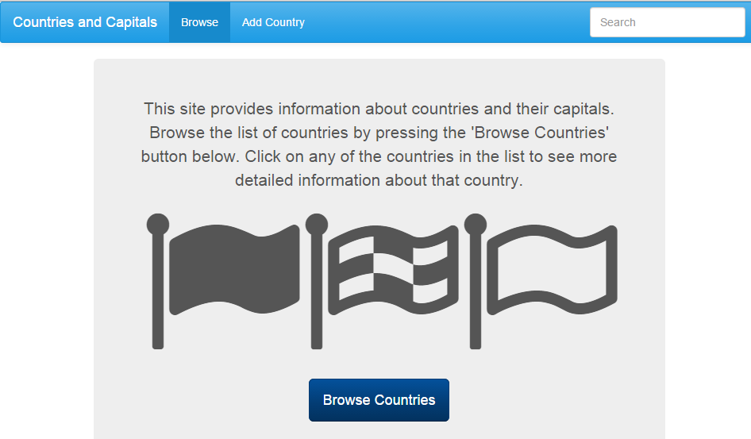
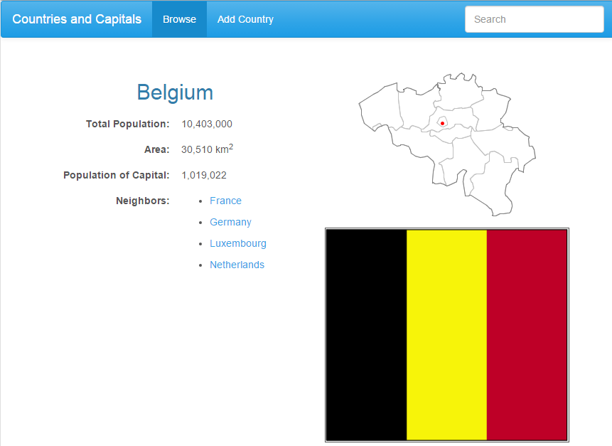

# Countries and Capitals
- a Thinkful app
- ngRoute, ngAnimate, UI-Bootstrap
- Cerulean from bootswatch

## CHANGES
- setup clean URL's
- add bootswatch Cerulean
- added jumbotron and navigation
- 2 col-xs-6 to countries.html page
- refactor JS to John Papa style
- added Search and Sorting for table data

## TODO
- add loading spinner / animation
- custom filters disregard accents, fix population/square foot sorting
- search only by name/capital option
- - https://gist.github.com/alejandrodazal/c66b0eb04c4515138beb

#### Front Page

#### Inner page

